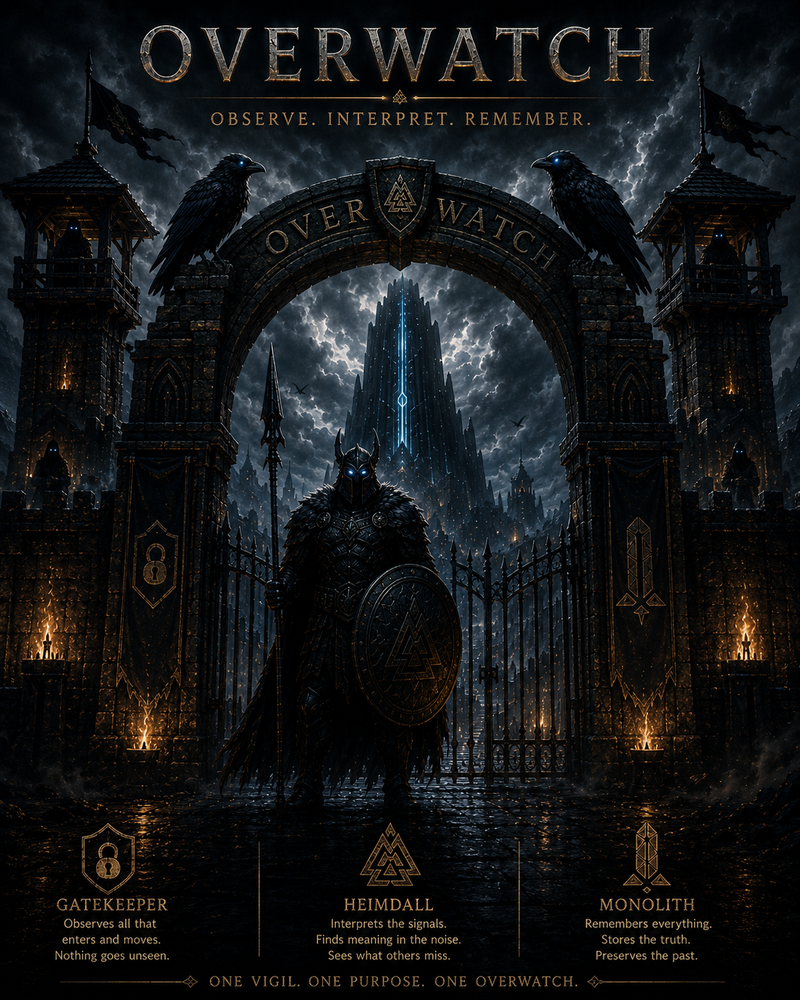

# OVERWATCH - HEIMDAL



Operational intelligence and telemetry interpretation subsystem for the OVERWATCH ecosystem.

---

## Purpose

Heimdal serves as the operational intelligence layer for OVERWATCH.

Its mission is to transform telemetry into explainable operational intelligence by identifying patterns, prioritizing risk, and deriving meaning from operational noise.

## Trust-Aware Ingestion

Heimdal now implements trust-aware telemetry ingestion to protect the operational cognition pipeline from malformed, incomplete, or potentially dangerous telemetry conditions.

The ingestion layer performs:

- telemetry validation
- required field verification
- telemetry normalization
- trust evaluation
- degraded telemetry classification
- safe operational modeling

## Graceful Operational Degradation

Heimdal is designed to preserve operational cognition continuity during unstable telemetry conditions, analyzer instability, or partial operational failures.

Rather than collapsing the intelligence pipeline during isolated analyzer failures, Heimdal now implements graceful degradation and resilient cognition boundaries.

### Resilience Capabilities

Current resilience protections include:

- analyzer fault isolation
- degraded cognition continuity
- safe operational fallback states
- defensive telemetry handling
- explainable degraded reasoning
- cognition preservation boundaries

### Operational Philosophy

Operational intelligence must survive uncertainty, instability, malformed telemetry, and degraded operational conditions.

Partial operational visibility is preferable to catastrophic cognition collapse.

### Analyzer Isolation Boundaries

Core analyzers now execute behind isolated orchestration boundaries designed to:

- prevent single-analyzer failure propagation
- preserve downstream operational reasoning
- maintain escalation awareness
- protect adaptive intelligence continuity
- support future operational adjudication

### Graceful Degradation Model

When instability occurs:

```text
Analyzer Failure
→ Safe Fallback State
→ Degraded Operational Reasoning
→ Continued Cognition Flow
```

## The Black Cells

The Black Cells represent OVERWATCH’s operational uncertainty isolation layer.

Their purpose is to safely contain telemetry, operational conditions, or analyzer states that cannot be trusted confidently by the operational cognition pipeline.

The Black Cells exist to protect Heimdal’s cognition integrity from potentially dangerous, contradictory, malformed, or highly uncertain operational telemetry.

### Black Cells Philosophy

Uncertain telemetry should be isolated, observed, and judged safely.

Operational uncertainty should never be allowed to poison cognition.

### Isolation Conditions

Telemetry may eventually be routed into the Black Cells when:

- telemetry trust scoring falls below acceptable thresholds
- malformed operational structures are detected
- analyzers produce contradictory operational conclusions
- telemetry integrity becomes uncertain
- operational behavior appears suspicious or inconsistent
- cognition confidence degrades significantly

### Operational Isolation Model

```text
Telemetry
→ Trust Evaluation
→ Suspicion Detection
→ Isolation (Black Cells)
→ Future Adjudication
```

### Black Cells Responsibilities

The Black Cells are intended to:

- isolate uncertain telemetry safely
- preserve operational evidence
- protect cognition continuity
- support future adjudication workflows
- prevent telemetry poisoning
- maintain operational observability during uncertainty

### Future Odin Integration

Future versions of OVERWATCH will allow Odin to evaluate isolated telemetry using:

- historical operational context
- trust lineage
- behavioral correlation
- operational consistency analysis
- adaptive intelligence review

### Long-Term Vision

The Black Cells prepare OVERWATCH for future:

- operational adjudication
- adaptive trust evolution
- telemetry lineage analysis
- hostile telemetry containment
- resilient cognition under uncertainty

## Resilient Cognition Flow

Heimdal now implements a layered operational cognition pipeline designed to preserve operational awareness during unstable, degraded, or uncertain telemetry conditions.

The operational flow now includes trust-aware ingestion, cognition protection boundaries, uncertainty isolation, and future adjudication preparation.

### Current Operational Cognition Flow

```text
Telemetry
    ↓
Validation
    ↓
Trust Evaluation
    ↓
Normalization
    ↓
Baseline Analysis
    ↓
Drift Detection
    ↓
Correlation Analysis
    ↓
Confidence Evaluation
    ↓
Stability Analysis
    ↓
Operational Posture
    ↓
Health Synthesis
    ↓
Adaptive Intelligence
    ↓
Escalation Awareness
```

### Resilient Operational Protection Flow

```text
Telemetry Instability
    ↓
Trust Degradation
    ↓
Analyzer Isolation
    ↓
Graceful Operational Degradation
    ↓
Black Cells Isolation
    ↓
Future Odin Adjudication
```

### Architectural Philosophy

Operational cognition should remain resilient under imperfect conditions.

The goal of Heimdal is not merely to detect operational conditions, but to preserve explainable operational awareness during instability, uncertainty, and degraded telemetry states.

### Long-Term Direction

Future operational cognition evolution may include:

- adaptive trust evolution
- telemetry lineage reasoning
- operational memory integration (Monolith)
- distributed cognition resilience
- adjudication intelligence (Odin)
- autonomous defensive response systems

### Long-Term Direction

This resilience model prepares Heimdal for future:

- Black Cells telemetry isolation
- operational adjudication workflows
- adaptive intelligence refinement
- distributed cognition resilience
- historical operational reasoning

### Ingestion Philosophy

Operational intelligence begins with trusted telemetry.

Untrusted or uncertain telemetry should never be allowed to poison operational cognition.

### Current Trust States

| State | Description |
|---|---|
| TRUSTED | Telemetry passed validation and normalization safely |
| DEGRADED | Minor inconsistencies or incomplete operational context detected |
| SUSPICIOUS | Significant telemetry inconsistencies detected |
| QUARANTINED | Unsafe telemetry isolated from operational cognition |

### Operational Goals

The trust-aware ingestion layer exists to:

- preserve cognition integrity
- prevent analyzer poisoning
- support graceful degraded reasoning
- maintain operational visibility during instability
- prepare uncertain telemetry for future adjudication workflows

### Architectural Evolution

The ingestion pipeline now follows:

```text
Telemetry
→ Validation
→ Trust Evaluation
→ Normalization
→ Operational Cognition
```

---

## Core Responsibilities

* telemetry ingestion
* telemetry normalization
* operational querying
* operational posture analysis
* explainable reasoning
* severity distribution analysis
* finding density analysis
* endpoint activity correlation
* operational prioritization
* escalation awareness
* operational summarization

---

## Ecosystem Architecture

```text
OVERWATCH
├── GateKeeper → Observe
├── Heimdal    → Interpret
└── Monolith   → Remember
```

---

## Operational Intelligence Pipeline

```text
Telemetry
→ Interpretation
→ Severity Awareness
→ Finding Density
→ Endpoint Correlation
→ Prioritization
→ Escalation Awareness
→ Operational Evidence
```

---

## Philosophy

Detection without understanding creates noise.

Detection with interpretation creates intelligence.

---

## OVERWATCH Operational Architecture

OVERWATCH is organized into specialized operational subsystems, each responsible for a distinct stage of the cybersecurity intelligence pipeline.

Rather than producing isolated alerts, OVERWATCH transforms raw telemetry into explainable operational intelligence through layered analysis, historical memory, operational judgment, and actionable recommendations.

The architecture follows the philosophy:

> **Observe → Interpret → Remember → Judge → Recommend**

```text
                            OVERWATCH
══════════════════════════════════════════════════════════════════════

                          GateKeeper
                           Observe
                              │
                              ▼
                 Execution Context
                 Observation Summary
                              │
                              ▼
══════════════════════════════════════════════════════════════════════
                            Heimdal
                         Operational Cognition
══════════════════════════════════════════════════════════════════════

                    Evidence Collection Layer

               • Baseline Analyzer
               • Drift Analyzer
               • Endpoint Analyzer
               • Finding Analyzer
               • Historical Analyzer
               • Correlation Analyzer
               • Severity Analyzer

                              │
                              ▼

                  Operational Assessment Layer

               • Confidence Analyzer
               • Stability Analyzer
               • Posture Analyzer
               • Priority Analyzer
               • Health Analyzer

                              │
                              ▼

                  Operational Cognition Layer

                    • Interpreter

                              │
                              ▼

                Operational Interpretation

══════════════════════════════════════════════════════════════════════

                              │
                              ▼

                          Monolith
                          Remember

                              │
                              ▼

                            Odin
                            Judge

                              │
                              ▼

                            Forge
                         Recommend

══════════════════════════════════════════════════════════════════════
```

### Architectural Responsibilities

| Subsystem | Responsibility |
|-----------|----------------|
| **GateKeeper** | Observes APIs and infrastructure, producing structured telemetry and operational observations. |
| **Heimdal** | Interprets telemetry using layered operational analyzers to produce explainable operational intelligence. |
| **Monolith** | Preserves historical execution context, operational memory, and telemetry lineage for future reasoning. |
| **Odin** | Evaluates operational intelligence and determines the appropriate operational response. |
| **Forge** | Generates explainable remediation guidance and recommended actions for analysts. |

### Architectural Philosophy

Each subsystem maintains a single operational responsibility.

Rather than combining detection, interpretation, memory, and decision-making into one component, OVERWATCH separates these concerns into specialized operational layers that communicate through well-defined interfaces.

This architecture promotes:

- Explainable operational reasoning
- Modular subsystem design
- Historical operational awareness
- Scalable intelligence evolution
- Human-centered decision support
- Separation of operational responsibilities

> **Detection without understanding creates noise. Detection with interpretation creates intelligence.**

## Architectural Principles

* modular subsystem architecture
* explainable operational reasoning
* telemetry-driven intelligence
* operational clarity over alert noise
* scalable intelligence layering
* maintainable orchestration pipelines
* separation of operational responsibilities

---

## Current Intelligence Capabilities

* operational posture awareness
* explainable telemetry reasoning
* severity concentration analysis
* endpoint hotspot awareness
* operational issue density analysis
* telemetry prioritization
* escalation condition analysis
* operational evidence correlation

---

## Keywords

Cybersecurity, Observability, Telemetry, Operational Intelligence,
Security Automation, Telemetry Analysis, Explainable Intelligence,
Risk Prioritization, Escalation Awareness, Endpoint Correlation,
Operational Awareness, Telemetry Normalization,
Security Engineering, Python, Intelligence Layer,
Observability Engineering, Telemetry Interpretation,
Security Monitoring, Operational Posture,
Threat Visibility, Modular Architecture
